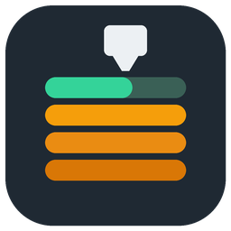
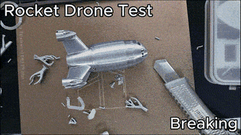
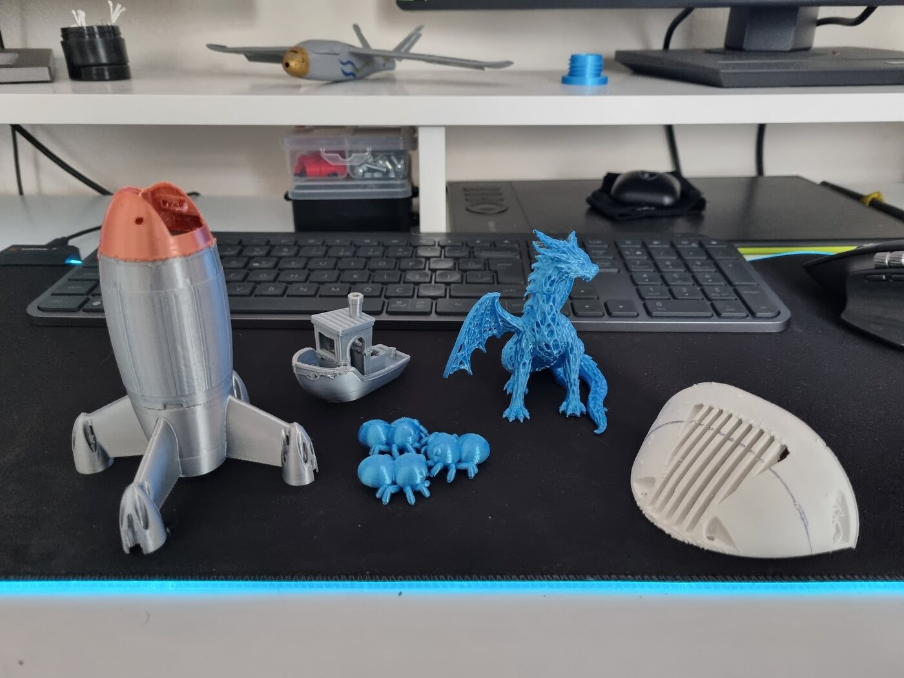
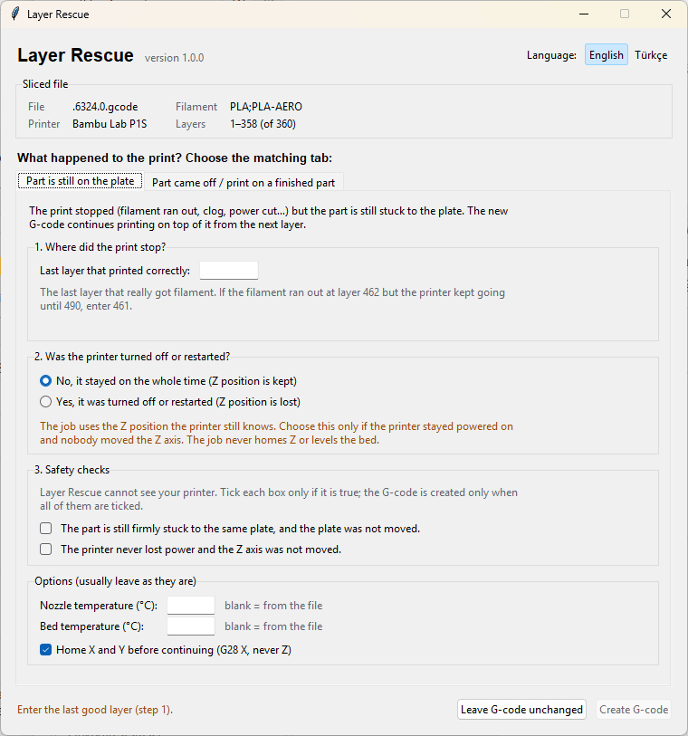
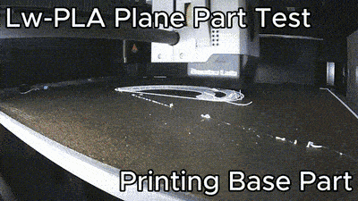
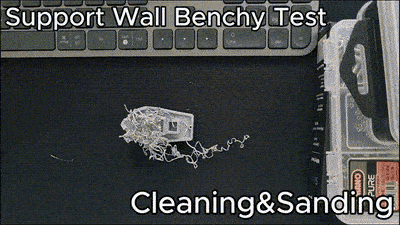
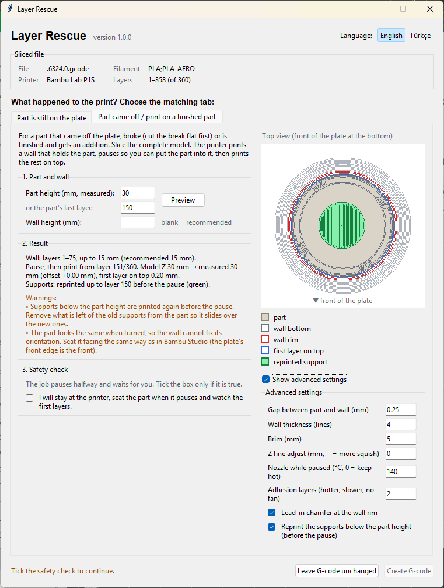

# Layer Rescue

[](https://github.com/EmirhanSyl/layer-rescue/actions/workflows/ci.yml)
[](https://github.com/EmirhanSyl/layer-rescue/releases)
[](LICENSE)

[English](README.md)

Yarım kalan her baskının yeri çöp kutusu olmak zorunda değil. Layer Rescue, yazıcınızın baskıya kaldığı yerden devam etmesini sağlar, elektrik kesilmiş olsa bile. Kırılan ya da plakadan kopan bir parçayı da plakaya geri oturtup eksik kalan kısmı üstüne basabilir.

Bambu Studio'nun içinde, post-processing script olarak çalışır. Her zamanki gibi dilimlersiniz, küçük bir pencerede birkaç soruyu cevaplarsınız ve Layer Rescue G-code'u yeniden yazar. Yazıcıya bir şey gitmeden önce sonucu Bambu Studio önizlemesinde görürsünüz.



_Bilerek kırılan bir roket drone gövdesi, plakaya geri oturtuluyor ve destekleriyle birlikte yeniden basılıyor. [Testin tamamı](docs/tests/04-broken-rocket-drone.tr.md)_

<p align="center"><a href="https://www.youtube.com/watch?v=efotZIYpkzM"></a></p>

<p align="center"><em>▶ Videonun tamamı (İngilizce): nasıl çalıştığı, üç mod ve bütün test baskıları bir arada.</em></p>

> [!CAUTION]
> Baskıyı devam ettirirken nozzle mevcut parçaya çarpabilir. Başlangıç sırasında yazıcının başında durun ve gerekirse hemen durdurun. Ayrıntılar için [SECURITY.md](SECURITY.md).

## Neler yapabiliyor?

- **Duran bir baskıya devam eder.** Filament bitti, nozzle tıkandı ya da baskıyı siz durdurdunuz: düzgün basılan son katmanı söylemeniz yeterli. İş, plakada duran parçanın tam üstünden, bir sonraki katmandan devam eder. ([Test 1](docs/tests/01-lw-pla-plane-part.tr.md))
- **Elektrik kesildikten sonra bile.** Yazıcı yeniden açıldığında Z'nin nerede olduğunu bilmez; Z'yi home etmek de parçayı nozzle'a doğru sürer. Bunun yerine nozzle'ı parçanın üstüne elle indirirsiniz ve Layer Rescue bütün Z hareketlerini o noktaya göre yapar. Z hiçbir zaman home edilmez. ([Test 2](docs/tests/02-power-loss-dragon.tr.md))
- **Kopan ya da kırılan parçayı geri koyup kalanını üstüne basar.** Plakadan kopmuş, sonradan kırılmış ya da üstüne ekleme yapılacak bir parça için. Yazıcı önce parçanın kendi dış hattından şekillenen alçak bir duvar basar, parçayı içine koymanız için duraklar, sonra eksik kalan üst kısmı parçanın üstüne basar. ([Test 3](docs/tests/03-detached-benchy.tr.md), [Test 4](docs/tests/04-broken-rocket-drone.tr.md))
- **Yeni kısmın ihtiyaç duyduğu destekleri yeniden kurar.** Eksik üst kısım desteklerin üstüne basılmışsa, Layer Rescue o destekleri tabladan başlayarak yeniden basar, içi boş bir parçanın içinde bile. Parçanın yoluna çıkacak her şeyi de dışarıda bırakır. ([Test 4](docs/tests/04-broken-rocket-drone.tr.md))
- **Dolu bir plakada kalanları kurtarır.** Kalabalık bir plakada birkaç parça koptuysa, onları Bambu Studio'da silip geri kalanları bitirebilirsiniz. ([Test 5](docs/tests/05-multi-object-spiders.tr.md))
- **Elle G-code düzenlemek yok.** Bambu Studio filament eşlemesini ve `.gcode.3mf` bilgilerini korur, önizleme de neyin basılacağını aynen gösterir.
- **Varsayılan olarak temkinli.** Parçanın üstündeyken Z'yi asla home etmez ve tabla seviyelemesi yapmaz, kaydetmeden önce kendi çıktısını kontrol eder, güvenle işleyemeyeceği dosyalarda tahmin yürütmek yerine işi reddeder ve orijinal G-code'un yedeğini tutar. Kendi göremediği şeyleri de pencerede size onaylatır.
- **Türkçe ve İngilizce**; dil, pencereden istediğiniz an değiştirilebilir.

## Gerçek testler

Her özelliği kendi P1S'imde gerçek baskılarla denedim ve hepsini videoları, ayarları ve çıkardığım derslerle adım adım yazdım. Beşi de başarılı oldu; ikisi ise kendiniz denemeden önce bilmeye değer şeyler öğretti.

<p align="center"></p>

<p align="center"><em>Kurtarılan beş baskının hepsi. Soldan: roket drone gövdesi, Benchy, üç örümcek, ejderha ve uçağın burun kapağı.</em></p>

| Test | Durum | Ne gösteriyor |
| --- | --- | --- |
| [1. LW-PLA uçak parçası](docs/tests/01-lw-pla-plane-part.tr.md) | filament sıkıştı, yazıcı açık kaldı | temel devam ettirme |
| [2. Ejderha](docs/tests/02-power-loss-dragon.tr.md) | elektrik kesildi | yeniden başlatmadan sonra devam etmek ve yanlış katman seçilince ne olduğu |
| [3. Benchy](docs/tests/03-detached-benchy.tr.md) | baskı plakadan koptu | yerleştirme modu ve yukarı doğru genişleyen parçaların neden biraz sıcak silikona ihtiyaç duyduğu |
| [4. Roket drone](docs/tests/04-broken-rocket-drone.tr.md) | bitmiş parça kırıldı | içi boş bir parçanın içinde tabladan yeniden kurulan desteklerle yerleştirme modu |
| [5. Örümcekler](docs/tests/05-multi-object-spiders.tr.md) | 5 parçadan 2'si koptu | yalnızca kalan parçaları bitirmek, üstelik geçiş izi görünmeden |

## Test edilenler

- Bambu Lab P1S, tek filament
- Windows ve macOS (Linux kaynaktan kurulumla)
- Bambu Studio G-code'u, katman bazlı baskı, göreli ekstrüzyon
- Parça aynı plakada sağlam duruyor (devam modu) ya da plakadan ayrılmış / bitmiş ve etrafına basılan duvara geri oturabiliyor (yerleştirme modu, beta)

Desteklenen yazıcı aileleri: Bambu Lab P1/X1 serisi (P1S'te test edildi; P1P, X1, X1C ve X1E aynı hareketleri kullanır) ve deneysel olarak H2 serisi (H2D, H2D Pro, H2S, H2C: purge, silme ve hotend seçimi stok H2 G-code'unu izliyor ama henüz gerçek bir yazıcıda çalıştırılmadı; yalnızca yazıcının açık kaldığı mod kullanılabilir). Bambu Lab A1'in kendi hareketleri var (stok başlangıç G-code'undaki gibi purge ve silme tablanın solunda, tabla dışında yapılır; henüz gerçek bir yazıcıda test edilmedi). A1 mini'nin de kendi hareketleri var (purge X-13.5'te). P2S'in (P1S ile aynı gövde ama H2 tarzı firmware makroları) ve aynı makroları kullanan, tabla kaydıran A2L'nin de kendi deneysel dizileri var. Diğer yazıcılar, riskleri kabul ettikten sonra P1/X1 hareketlerini kullanır.

Henüz test edilmeyenler: diğer yazıcı modelleri ve AMS/çok filamentli işler. Bir iş test edilen kurulumun dışında kalıyorsa Layer Rescue bunun sebebini söyler ve devam etmeden önce riskleri kabul etmenizi ister (CLI: `--allow-untested`). Birden fazla filament varsa, devam edilen katmanda kullanılan filamenti yükler. Bunlardan birini denerseniz lütfen [sonuçlarınızı paylaşın](#sonuçlarınızı-paylaşın).

Nesne bazlı baskı ve spiral vazo, Layer Rescue'nun çalışma şekline henüz uymuyor; bu yüzden bu işler hâlâ reddediliyor.

## Kurulum

İndirmeler [Releases](https://github.com/EmirhanSyl/layer-rescue/releases) sayfasında.

**Windows:** `LayerRescue-Setup-<sürüm>-win-x64.exe` dosyasını çalıştırın. Kurulumun son sayfasında Bambu Studio'ya yapıştırılacak komut yazar.

**macOS (Apple Silicon):** `LayerRescue-<sürüm>-macos-arm64.zip` dosyasını açıp `LayerRescue.app` uygulamasını Uygulamalar klasörüne taşıyın. Uygulama henüz Apple Developer ID ile imzalı olmadığı için macOS ilk açılışta engeller:

1. `LayerRescue.app` uygulamasına çift tıklayın. macOS açılamayacağını söyler; **Bitti**'ye basın.
2. **Sistem Ayarları → Gizlilik ve Güvenlik** bölümünde aşağı inip Layer Rescue'nun yanındaki **Yine de Aç** düğmesine basın.
3. Uygulama açılır ve Bambu Studio'ya yapıştırılacak komutu gösterir.

Bunu Bambu Studio'dan kullanmadan önce bir kez yapın, yoksa Studio uygulamayı başlatamaz. Alternatif olarak `xattr -dr com.apple.quarantine /Applications/LayerRescue.app` komutunu çalıştırabilirsiniz.

**Intel Mac, Linux ve diğerleri:** Python 3.10+ ile [PyPI paketini](https://pypi.org/project/layer-rescue/) kurun (pencere için Tkinter gerekir; Homebrew Python kullanıyorsanız `brew install python-tk` de çalıştırın):

```bash
pipx install layer-rescue
```

## Bambu Studio ayarı

1. Bambu Studio'yu Advanced moda alın.
2. Process ayarlarında **Others** sekmesini açıp **Post-processing Scripts** alanını bulun.
3. Layer Rescue'nun tam yolunu tırnak içinde yazın:

   | Kurulum | Komut |
   | --- | --- |
   | Windows kurulumu | `"C:\Users\<kullanıcı>\AppData\Local\Programs\LayerRescue\LayerRescue.exe"` |
   | macOS uygulaması | `"/Applications/LayerRescue.app/Contents/MacOS/LayerRescue"` |
   | pipx | `which layer-rescue` çıktısı, örn. `"/Users/<kullanıcı>/.local/bin/layer-rescue"` |

   Uygulamayı Bambu Studio olmadan doğrudan açarsanız kendi kurulumunuza ait komutu gösterir.

Post-processing script'ler çalıştırılabilir dosya olduğu için Studio uyarı gösterebilir. Yalnızca güvendiğiniz kaynaktan kurduğunuz araçları onaylayın.

İpucu: script'i ekledikten sonra process preset'ini kaydedin, bir dahaki sefere bir şeyler ters gittiğinde hazırda beklesin.

## Pencere

Dilimlemeden sonra Layer Rescue küçük bir pencere açar. En üstte aldığı dosyayı (yazıcı, filament, katman sayısı) gösterir, altında da her durum için bir sekme vardır:

- **Parça hâlâ plakada**: yarım kalan baskıya devam etmek için (aşağıda).
- **Parça ayrıldı / bitmiş parçanın üstüne bas**: yerleştirme modu (daha aşağıda).

<p align="center"></p>

_Ekran görüntüleri İngilizce arayüzden; pencerenin sağ üstünden Türkçeye geçebilirsiniz._

Her sekme kısa, numaralı adımlardan oluşur. Devam sekmesinde baskının nerede durduğunu girer, yazıcının kapatılıp kapatılmadığını seçer ve Layer Rescue'nun kendi göremediği birkaç şeyi **Güvenlik kontrolleri** altında onaylarsınız. Gerekli her şey doldurulana kadar **G-code oluştur** düğmesi pasif kalır; sol alttaki satır neyin eksik olduğunu yazar. **G-code'u değiştirme** pencereyi dosyaya dokunmadan kapatır; normal baskılarda bunu kullanın.

İş henüz test edilmemiş bir yazıcı ya da filament kurulumu içinse, sekmelerin üstünde ek olarak bir **Test edilmemiş kurulum** kutusu çıkar. Sebebini açıklar ve devam edebilmeniz için riskleri kabul etmenizi ister.

**Dil:** sağ üstteki **English / Türkçe** düğmelerini kullanın. Değişiklik hemen uygulanır ve bir sonraki açılış için hatırlanır. İlk açılışta sistem dilinize göre seçilir. (Komut satırı çıktısı İngilizce kalır.)

## Baskıya devam etme



1. Gerçekten filament basılmış son katmanı bulun (aşağıdaki [Katmanı seçmek](#katmanı-seçmek) bölümüne bakın).
2. Orijinal projeyi hiçbir şeyini değiştirmeden yeniden dilimleyin. Layer Rescue penceresi **Parça hâlâ plakada** sekmesiyle açılır.
3. **Adım 1 – Baskı nerede durdu?** Düzgün basılan son katmanı girin. Pencere, baskının hangi katmandan ve hangi Z yüksekliğinden devam edeceğini gösterir.
4. **Adım 2 – Yazıcı kapatıldı ya da yeniden başlatıldı mı?**
   - **Hayır, hep açık kaldı** (`retained`): yazıcı Z konumunu korudu. Başka bir şey yapmanız gerekmez.
   - **Evet, kapatıldı ya da yeniden başlatıldı** (`manual`): yazıcı kapatılıp açıldıysa Z home edilmemiştir. Tablayı yeniden ısıtın, nozzle'ı temizleyin, son düzgün katmanın düz bir bölgesinin üstüne getirin ve yüzeye hafifçe değene kadar indirin. Yazıcı Z'yi home etmeyi teklif ederse kabul etmeyin. Parçayı ve plakayı oynatmayın. ([Test 2](docs/tests/02-power-loss-dragon.tr.md) bunu adım adım gösteriyor.)
5. **Adım 3 – Güvenlik kontrolleri.** Layer Rescue yazıcıyı göremediği için varsaydığı şeyleri sizin onaylamanız gerekir. Her kutuyu yalnızca doğruysa işaretleyin:
   - parça hâlâ aynı plakaya sağlam yapışık ve plaka yerinden oynatılmadı;
   - _Hayır, hep açık kaldı_ seçiliyse: yazıcının elektriği hiç kesilmedi ve Z ekseni oynatılmadı;
   - _Evet, yeniden başlatıldı_ seçiliyse: işi başlatmadan önce temiz nozzle'ı son düzgün katmana indireceksiniz.

   Yalnızca 2. adımdaki seçime ait kontrol gösterilir.

6. **Seçenekler** genelde olduğu gibi kalabilir: nozzle ve tabla sıcaklığı (boş = dosyadaki değer) ve devam etmeden önce X/Y'yi home etmek (yeniden başlatmadan sonra her zaman açık; Z hiçbir zaman home edilmez).
7. **G-code oluştur**'a basın, Bambu Studio önizlemesini kontrol edin ve işi gönderin.

### Katmanı seçmek

Layer Rescue'nun sizin yerinize veremeyeceği tek karar bu ve her şeyden daha önemli. Baskı bozulduğunda son birkaç katman çoğu zaman incecik kalır ya da hiç basılmamıştır, yazıcı yine de onları basılmış sayar. Bu yüzden sayaca değil parçaya bakın. Filament 462. katmanda bittiyse ama yazıcı 490'a kadar devam ettiyse 461 girin. Elinizde bir kayıt ya da timelapse varsa çok işe yarar.

Sadece 2–3 katmanlık bir hata bile kendini belli eder:

- **Yazıcı açık kaldıysa:** fazla yüksek seçerseniz arada boşluk kalır, birleşim yeri zayıf ve çok belirgin olur; fazla düşük seçerseniz nozzle parçaya girer ve onu plakadan kolayca sökebilir. ([Test 1](docs/tests/01-lw-pla-plane-part.tr.md))
- **Yeniden başlatmadan sonra:** Z, nozzle'ı koyduğunuz yerden gelir; bir şey çarpmaz ama oraya yanlış katmanlar basılır. Fazla düşük seçerseniz birkaç katman iki kez basılır, fazla yüksek seçerseniz atlanır ve birleşim yerinde detaylar üst üste oturmaz. ([Test 2](docs/tests/02-power-loss-dragon.tr.md) tam olarak bu hatayı anlatıyor.)

Baskıyı ne zaman durduracağınızı seçme şansınız varsa, bir katman bittikten hemen sonra durdurun. [Test 5](docs/tests/05-multi-object-spiders.tr.md)'te bu sayede geçiş hiç belli olmadı.

### Plakada birden fazla obje varsa

Kalabalık bir plakada bazı parçalar koptuysa onları alın, Bambu Studio'da silin ve yeniden dilimleyin. Layer Rescue G-code'da ne varsa ona devam eder; projede bıraktığınız her şey basılır, plakada değilse havaya. Kalan parçaları taşımayın, döndürmeyin, **Arrange** da yapmayın; basıldıkları yerde aynen durmaları gerekir. ([Test 5](docs/tests/05-multi-object-spiders.tr.md))

## Parçayı yerleştir ve üstüne bas (yerleştirme modu, beta)



Yarıda plakadan kopmuş, sonradan kırılmış ya da üstüne ekleme yapılacak bitmiş bir parça için. Tam modeli (eski parça + üstüne gelecek kısım, tek obje) dilimlersiniz. Layer Rescue parçanın üst yüzeyinin altındaki katmanları, parçanın dış hattını takip eden bir tutucu duvarla değiştirir, duraklar ve duvara yerleştirdiğiniz parçanın üstüne kalanını basar.

1. Parçayı hazırlayın: brim'i ve ipleri temizleyin. Kırık bir parçayı önce düz kesin ya da zımparalayın. Yüksekliğini kumpasla ölçün.
2. Tam modeli dilimleyin. Layer Rescue penceresinde **Parça ayrıldı / bitmiş parçanın üstüne bas** sekmesini açın.
3. **Parça yüksekliğini** (ya da parçanın içerdiği son katmanı) ve isterseniz **duvar yüksekliğini** girin (boş = önerilen: parçanın yarısı, 3–15 mm, her zaman tepeden en az 1 mm aşağıda). **Önizle**'ye basınca duvarı üstten görürsünüz; **Sonuç** bölümünde de baskının nereden devam edeceği ve varsa uyarılar yazar.
4. **Güvenlik kontrolü** kutusunu işaretleyin (yazıcının başında kalacak, duraklayınca parçayı yerleştirecek ve ilk katmanları izleyeceksiniz), **G-code oluştur**'a basın ve işi gönderin. Yazıcı boş tablayı seviyeler, duvarı basar, parça yüksekliğinin 15 mm üstüne çıkar, arkaya park eder ve duraklar (`M400 U1`).
5. Plakayı çıkarmadan ve oynatmadan parçayı duvara Bambu Studio'daki yönüyle (modelin önü plakanın önüne gelecek şekilde) bastırın, sonra yazıcıda **Resume**'a basın.
6. Yazıcı yeniden ısınır, purge yapar, parçanın üstüne gelir ve kalanını basar. Parçaya değen ilk 2 katman, iyi yapışması için 10 °C daha sıcak, yarı hızda ve parça fanı kapalı basılır.

<p align="center"></p>

**Önizle**'ye bastıktan sonra sağ tarafta plaka üstten görünür: parça (bej), duvarın tabanı ve ağzı (gri ve kırmızı), parçanın üstüne basılacak ilk katman (mavi) ve yeniden basılacak destekler (yeşil). Soldaki **Sonuç** bölümü hangi katmanların duvar olacağını, duraklamadan sonra baskının nereden devam edeceğini ve parçanın üstündeki ilk katmanın ne kalınlıkta olacağını yazar; ardından varsa uyarılar gelir. Gelişmiş ayarlar önizlemenin altında açılır.

Duvar nasıl oluşur: parçanın kendi dış hattı, dilimlenmiş katmanlardan duvar yüksekliğine kadar okunur. Parça yukarıdan indirildiği için her yükseklikteki açıklık, altındaki bütün kesitlerin geçmesine izin verir. Varsayılan olarak 0,25 mm boşluk, 4 çizgi kalınlığında duvar, 5 mm brim ve ağızda küçük bir giriş pahı vardır. Hepsi **Gelişmiş ayarları göster** işaretlendiğinde (önizlemenin yanında) değiştirilebilir.

**Destekler.** Modelde parça yüksekliğinin üstüne uzanan destekler varsa (örneğin içi boş bir parçanın içindeki ya da yanındaki ağaç destekler), bunların alt kısmı, parça indirilirken çarpmayacağı her yerde duraklamadan önce yeniden basılır. Parçayı yerleştirmeden önce üzerindeki eski destekleri temizleyin. Yalnızca parçanın kendi çıkıntılarını taşıyan destekler basılmaz. Bunu gelişmiş ayarlardaki **Parça yüksekliğinin altındaki destekleri yeniden bas** ile kapatabilirsiniz (CLI `--no-reprint-supports`). [Test 4](docs/tests/04-broken-rocket-drone.tr.md) bunu içi boş bir roket gövdesinde gösteriyor.

**Parçanın iyi oturması için:**

- Parça duvarın içinde boşta kalıyorsa boşluğu küçültün. Yuvarlak bir parçada varsayılan 0,25 mm açıkça fazla gevşek kalmıştı, 0,12 mm ise çok daha sıkı oturdu.
- **Yukarı doğru genişleyen parçalar** (tekne gövdesi gibi) duvara yalnızca eğimli yüzeylerden değer, bu yüzden nozzle onları sürükleyip yukarı kaldırabilir. Böyle bir parçayı birleşim çizgisine birkaç damla sıcak silikonla sabitleyin; silikonu parçaya değil duvara sıkın, sonrasında parçadan temiz çıkar. ([Test 3](docs/tests/03-detached-benchy.tr.md))
- Parçayı her yerden düz oturtun. Bir tarafın sadece 0,2 mm yukarıda kalması bile diğer tarafta katman izi olarak görünür.

Sınırlar: plakada tek obje, prime tower kapalı, parça en az 3 mm yüksek ve 5 mm geniş. Üste basılan her şeyin Z'si, ölçülen yükseklik ile en yakın model katmanı arasındaki fark kadar kaydırılır; böylece ilk katman gerçek parçanın üstüne oturur. Üst yüzey kesilmiş bir yüzeyse (dolgu açıkta), Bambu Studio'da parça yüksekliğinden yaklaşık 0,6 mm yukarıya kadar %100 dolgulu bir height range modifier ekleyin, böylece ilk katmanlar dolu basılır.

## Oluşturulan iş ne yapar?

Orijinal başlık ve ayarları korur, başlangıç rutinini ve basılmış katmanları çıkarır, sıcaklıkları, fanları ve hareket limitlerini geri yükler. Nozzle'ı kaldırır, yalnızca X/Y eksenlerini home eder (`G28 X`), arkadaki atık kanalında purge yapar, katmanın ilk noktasının üstüne gider, aşağı iner ve orijinal G-code ile sona kadar devam eder.

Z eksenini hiçbir zaman home etmez ve tabla seviyelemesi yapmaz. Manuel modda bütün Z hareketleri sizin hizaladığınız konuma göre görelidir; yazıcı yeniden başlatıldıktan sonra kendini hangi Z'de sanırsa sansın sonuç değişmez.

Dosya yerinde değiştirilir, orijinalin bir kopyası `.layer-rescue.bak` uzantısıyla yanında kalır.

## Sınırlar ve sırada ne var?

Layer Rescue baskıları kurtarıyor ama tamiri görünmez yapamıyor ve henüz her şeyi yapamıyor. Beklemeniz gerekenler:

- **Birleşim yeri genelde belli olur.** Çoğu testte, doğru katman seçilse bile baskının yeniden başladığı yerde görünür bir katman izi kaldı. Doğru katmanla elimden geçen birleşim yerlerinde yırtılma, kopma ya da ezilme olmadı; ama henüz düzgün dayanıklılık testleri yapmadım ve sonuç modele ve filamente göre değişiyor. İşlevsel parçalarda birleşim yerine birkaç damla japon yapıştırıcısı sürmenin zararı olmaz.
- **Katmanı siz seçiyorsunuz ve hatalar belli oluyor.** Baskının gerçekte nerede durduğunu otomatik bulan bir şey yok. [Katmanı seçmek](#katmanı-seçmek) bölümüne bakın.
- **Yeniden başlatmadan sonra sonuç sizin elinize bağlı.** Nozzle parçanın üstüne gözle yerleştiriliyor.
- **Yerleştirme modu hâlâ beta.** Parçanın duvara ne kadar iyi oturduğu büyük ölçüde şekline bağlı: bazıları içine girip sıkıca oturuyor, bazıları kayabiliyor, bazıları yapıştırma istiyor, bazıları hiç oturmayabiliyor. Yuvarlak parçaların yönünü duvar sabitleyemiyor, doğru yönde oturtmak size kalıyor. Plakada tek obje ve prime tower olmadan çalışıyor.
- **Şimdilik tek yazıcıda test edildi.** Yukarıdaki her şey tek filamentli bir Bambu Lab P1S'te test edildi. Diğer yazıcıları ve çok filamentli işleri pencerede riskleri kabul ederek deneyebilirsiniz; ama başlangıcı yakından izleyin: P1/X1 hareketleri bir P1S'te hazırlandı, H2 dizisi ise yalnızca dilimlenmiş dosyalar üzerinden kontrol edildi.
- **H2 serisinde, P2S'te ve A2L'de elektrik kesintisi modu deneysel.** Elektrik kesintisinden sonra Z'ye home atılmamış olur; H2'nin ihtiyaç duyduğu purge, silme ve X home komutları (`G150.3`, `G150.2`, `G150.1`, `G28 X T300`) ise home atılmamış bir eksende Z'yi nasıl hareket ettirdiği belgelenmemiş firmware makroları. Layer Rescue, stok başlangıç G-code'u gibi bu komutlardan önce (bitiş G-code'undakilerden önce de) tablayı 30 mm indiriyor; ama bu henüz bir yazıcıda denenmedi: ilk hareketleri izleyin ve durdurmaya hazır olun. A2L'de ayrıca timelapse'i kapatın: timelapse her katmanda parçanın 0.4 mm üstündeyken `G150.3` ile purge kutusuna gidiyor.

### Yol haritası

**Kısa vade: olanı güvenilir hale getirmek**

- Gerçek baskılardan alınmış sabit test dosyaları. Böylece yeni bir özellik eski bir senaryoyu sessizce bozamaz.
- Hata bildirimleri için sürümü, yazıcıyı, ayarları ve uyarıları tek metne koyan bir "Raporu kopyala" butonu.
- Son düzgün katmanı bulmaya yardım, örneğin kumpasla ölçülen yüksekliği katman numarasına çevirmek.
- Kalabalık bir plakada başarısız objeleri yeniden dilimlemeden çıkarmak.
- Pencerede ne olduğunu sorup doğru modu seçen kısa bir yönlendirme.
- Başka yazıcılarda (X1C, A1, H2D ve diğerleri) test edenlerden gelen raporlar ve bir SSS.

**Orta vade: yerleştirme modunda daha çok şekil**

- Yukarı doğru genişleyen parçalar ve bugün duvara iyi oturmayan diğer şekiller.
- Parçanın şekline göre boşluk ön ayarları.
- Daha geniş bir parça yelpazesinde çalıştığında yerleştirme modunun beta'dan çıkması.
- Araştırma: elektrik kesintisinden sonra Z'yi gözle ayarlamak yerine otomatik ayarlamak; nozzle'ı parçaya dokundurarak ya da kamera veya yazıcının diğer verileriyle. Fikir [u/robiebab](https://www.reddit.com/r/BambuLab/comments/1wvchb4/comment/pdcqgs8/)'den.

**Uzun vade: tabladan başlamayan destekler**

- Araştırma: uzun bir çıkıntıyı altındaki desteğin tamamını basmadan taşımak. Modele eklenen birkaç küçük çıkıntının üstüne baskı sırasında metal bir çubuk ya da sert bir parça konuyor, çıkıntılı kısım onun üzerine basılıyor. Fikir [u/Thing1_Tokyo](https://www.reddit.com/r/3Dprinting/comments/1wvcdxq/comment/pdayrw4/)'dan.
- OrcaSlicer desteği ve başka yazıcı aileleri.

Buraya uymayan bir fikriniz ya da kullanım senaryonuz mu var? [Bir issue açın](https://github.com/EmirhanSyl/layer-rescue/issues/new/choose).

## Sonuçlarınızı paylaşın

Layer Rescue gördüğü her gerçek baskıyla daha iyi hale geliyor. Bir şey çalışmadıysa ya da sonuç tuhaf göründüyse lütfen G-code'unuz, yazıcınız ve firmware sürümünüz, kullandığınız ayarlar ve birkaç fotoğrafla bir [issue açın](https://github.com/EmirhanSyl/layer-rescue/issues/new/choose). Bir baskınızı kurtardıysa, özellikle benim denemediğim bir yazıcıda ya da filamentte, bunu da duymak isterim: yeni kurulumlarda alınan başarılı sonuçlar, onların açılabilmesi için tam olarak ihtiyaç duyulan şey.

## Komut satırı

```bash
layer-rescue --analyze print.gcode
layer-rescue --last-layer 461 --z-mode retained print.gcode
layer-rescue --last-layer 461 --z-mode manual --confirm-manual-z-aligned print.gcode
```

Yerleştirme modu:

```bash
layer-rescue --part-height 23.4 --wall-height 10 --confirm-attended print.gcode
layer-rescue --part-layer 117 --confirm-attended --preview-svg wall.svg print.gcode
```

Yerleştirme seçenekleri: `--clearance`, `--wall-lines`, `--brim`, `--no-chamfer`, `--z-fine`, `--standby-temp`, `--adhesion-layers`, `--no-reprint-supports`.

`--allow-untested`, test edilmemiş bir yazıcının ya da çok filamentli bir işin risklerini kabul eder. `--nozzle-temp` ve `--bed-temp` algılanan sıcaklıkları değiştirir. Bütün seçenekler için `layer-rescue --help`.

## Teşekkür

Baskıyı belli bir katmandan devam ettirme fikri CNC Kitchen'ın [yarım kalan baskıyı kurtarma rehberinden](https://www.cnckitchen.com/blog/guide-resuming-a-failed-3d-print) geliyor. Bu projeye başlarken asıl amacım o rehberdeki elle yapılan adımları Bambu Studio için otomatikleştirmekti; konuyu bu kadar anlaşılır anlattıkları için CNC Kitchen'a teşekkürler. Bunun dışındaki her şey (tutucu duvarıyla birlikte yerleştirme modu, desteklerin yeniden basılması, güvenlik kontrolleri ve çıktı doğrulaması) Layer Rescue için sıfırdan tasarlandı.

Testlerde kullandığım modellerin tasarımcılarına da teşekkürler:

- Uçak parçası: Flightory'nin [Talon 1400](https://flightory.com/product/talon-1400/) modeli
- Ejderha: MakerWorld'de DElex3D'nin [Mystic Dragon](https://makerworld.com/tr/models/3015782-mystic-dragon-breathtaking-dragon-figure#profileId-3435682) modeli
- Tekne: klasik [3DBenchy](https://www.3dbenchy.com/)
- Roket drone: MakerWorld'de luisengineering'in [Sub-250g SpeedDrone](https://makerworld.com/tr/models/2637662-sub-250g-speeddrone-320km-h-fast#profileId-2913683) modeli
- Örümcekler: MakerWorld'de formastampa'nın [The World's Smallest Spider](https://makerworld.com/tr/models/2864339-the-world-s-smallest-spider-nozzle-0-4#profileId-3196930) modeli

Yol haritasında topluluktan gelen fikirler de var: elektrik kesintisinden sonra otomatik Z fikri için [u/robiebab](https://www.reddit.com/r/BambuLab/comments/1wvchb4/comment/pdcqgs8/)'e, yerleştirilen nesneyi destek olarak kullanma fikri için [u/Thing1_Tokyo](https://www.reddit.com/r/3Dprinting/comments/1wvcdxq/comment/pdayrw4/)'ya teşekkürler.

## Katkı

En faydalı katkı; yazıcı modeli, firmware sürümü ve G-code dosyasıyla birlikte açılan hata kayıtlarıdır. Ayrıntılar için [CONTRIBUTING.md](CONTRIBUTING.md).

## Lisans

[MIT](LICENSE). Bambu Lab ile bağlantılı değildir ve Bambu Lab tarafından onaylanmamıştır.
