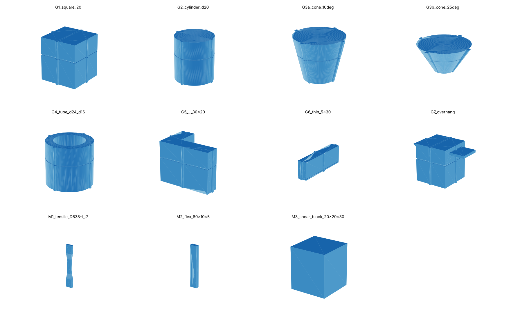

# Benchmark modelleri

[English](README.md)

Insert mode çalışmasının test parçaları (test planı: T1–T12). Hepsi `generate_models.py` betiğinin başındaki parametrelerden üretilir; böylece makalede kullanılan geometri birebir yeniden oluşturulabilir.

```
pip install manifold3d trimesh numpy
python generate_models.py
```



Her parça baskı yönünde, ayakta durur (Z = baskı yönü). **Dikiş Z**, baskının durdurulup parçanın yeniden oturtulduğu yüksekliktir; insert sekmesine parça yüksekliği olarak bu değer girilir. 0,20 mm katmanda son sağlam katman **dikiş Z / 0,2**'dir. Duvar sütunu, Layer Rescue'nun o dikiş için varsayılan duvar yüksekliğidir (clamp(Z/2, 3, 15), en fazla Z − 1).

| Dosya | Boyut X × Y × Z (mm) | Dikiş Z (mm) | Son sağlam katman (0,20 mm) | Varsayılan duvar (mm) | Hacim (cm³) | Testler |
| --- | --- | --- | --- | --- | --- | --- |
| M1_tensile_D638-I_t7 | 19,0 × 7,0 × 165,0 | 82,5 | 412 | 15,0 | 18,36 | T3, T5 |
| M2_flex_80x10x5 | 10,0 × 5,0 × 80,0 | 40,0 | 200 | 15,0 | 4,00 | T4 |
| M3_shear_block_20x20x30 | 20,0 × 20,0 × 30,0 | 15,0 | 75 | 7,5 | 12,00 | T4 (kontrol) |
| G1_square_20 | 21,6 × 21,6 × 30,0 | 20,0 | 100 | 10,0 | 12,08 | T1, T2, T11 |
| G2_cylinder_d20 | 21,6 × 21,6 × 30,0 | 20,0 | 100 | 10,0 | 9,50 | T1, T2, T11 |
| G3a_cone_10deg | 29,24 × 29,24 × 30,0 | 20,0 | 100 | 10,0 | 11,05 | T1, T2 |
| G3b_cone_25deg | 48,38 × 48,38 × 30,0 | 20,0 | 100 | 10,0 | 23,06 | T1, T2 |
| G4_tube_d24_d16 | 25,6 × 25,6 × 30,0 | 20,0 | 100 | 10,0 | 7,61 | T1, T2 |
| G5_L_30x20 | 31,6 × 21,6 × 30,0 | 20,0 | 100 | 10,0 | 10,15 | T1 |
| G6_thin_5x30 | 6,6 × 31,6 × 13,0 | 3,0 | 15 | 2,0 | 1,97 | T1 |
| G7_overhang | 34,49 × 21,6 × 30,0 | 20,0 | 100 | 10,0 | 12,45 | T7 |

Aynı sayılar `models.json` dosyasında makine tarafından okunabilir biçimde de var.

## Parçalar ne için

- **M1** – ASTM D638 Tip I dış hatlı çekme çubuğu (165 mm boy, 13 × 7 mm ölçüm kesiti, R76 geçişler; 7 mm Tip I'in izin verdiği en kalın değer ve uzun çubuğun sallanmasını önler). Dikiş, ölçüm bölgesinin ortasında yüke dik gelecek şekilde ayakta basılır. Uzun ve ince olduğu için 10 mm brim ve düşük hızlanmayla bas.
- **M2** – 80 × 10 × 5 mm eğilme çubuğu, ayakta basılır, dikiş açıklığın ortasında. ISO 178 4 mm kalınlık ister; insert mode en az 5 mm dar kenar gerektirdiği için 5 mm kullanıldı. Bu sapma makalede belirtilmeli.
- **M3** – Dikiş boyunca basit kesme kontrolü için 20 × 20 × 30 mm blok.
- **G1–G7** – Hizalama parçaları. Her birinde dikişi dikey kesen dört referans nervürü (1,0 mm geniş, 0,8 mm yüksek, 90° arayla) ve dikişin 2 mm altında Z referansı olarak 0,4 mm derin bir çentik var. Nervürlerin dikişteki basamağı XY kaymasını ve dönmeyi verir (bkz. T1). G1 kare, G2 silindir, G3a/G3b yukarı genişleyen koniler (yan başına 10° ve 25°, taban Ø16), G4 tüp, G5 L kesit, G6 yazılım sınırındaki ince parça (5 mm dar kenar, 3 mm insert yüksekliği), G7 = G1 + dikişin üstünde 0° çıkıntı (+X) ve 45° çıkıntı (−X), destek yeniden basımı için.

## Notlar

- Test planındaki ayarları kullan (0,20 mm katman, 4 duvar, M parçalarında %100 dolgu) ve dilimleyici ayarlarını gruplar arasında sabit tut.
- Çentik, kesiti Z = dikiş − 2 mm'de biraz küçültür; yalnızca G parçalarında var, mekanik numunelerde yok.
- Her basılan parçayı numune ID'siyle (örn. `T1-G1-c010-02`) nervürlerden uzak bir yüzeye kalemle ya da Bambu Studio'nun yazı aracıyla etiketle.
