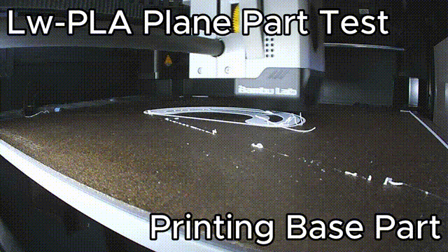

# Test 1: LW-PLA plane part after a filament jam

[Türkçe](01-lw-pla-plane-part.tr.md)

**Mode:** resume (part still on the plate) · **Printer:** Bambu Lab P1S · **Result:** worked



## What happened

I was printing the nose cover of an RC plane (the `Flightory's Talon1400` nose part) in lightweight PLA when the filament jammed. The print had reached layer 64 of 180, a bit over half, and the part was still stuck firmly to the plate. Starting over would have meant throwing away hours of printing and a good amount of filament, and this is exactly the situation Layer Rescue was made for.

|                      |                                                               |
| -------------------- | ------------------------------------------------------------- |
| Model                | RC plane nose cover, curved shell with vent slots, 180 layers |
| Filament             | Creality PLA Hyper Low Weight (LW-PLA)                        |
| Temperatures         | nozzle 230 °C, bed 55 °C                                      |
| Plate                | textured PEI                                                  |
| Nozzle               | 0.4 mm                                                        |
| Stopped at           | layer 64 / 180 (53 %)                                         |
| Layer Rescue version | 0.2.2                                                         |

## Step by step

### 1. The print stops


The first half printed normally. After the jam I stopped the job from the **Device** tab in Bambu Studio. (You can just as well stop it on the printer itself.) The progress bar shows `Layer: 64/180`.


The important part here is what I _didn't_ do: I didn't take the plate off, didn't touch the part and didn't turn the printer off. The printer stayed on, so it still knows exactly where Z is, and that makes the resume as simple as it gets.

Before slicing, look closely at the part and find the last layer that really printed properly. When a jam starts, the last few layers are often thin or missing even though the printer counts them as done. Go by the part, not by the counter. In my test, the counter stopped on 64, the top layer looked fine, so I entered 64 as the last successfully printed layer.

### 2. Add Layer Rescue to Bambu Studio Project (one time only)


You only do this once:

1. Switch Bambu Studio to **Advanced** mode (the toggle next to the process preset).
2. Open the **Others** tab in the process settings and scroll down to **Post-processing scripts**.
3. Paste the path to Layer Rescue in quotes, for example:

   ```text
   "C:\Users\<you>\AppData\Local\Programs\LayerRescue\LayerRescue.exe"
   ```

I saved it into my own LW-PLA process preset, so it's there whenever I need it.

### 3. Slice the same project again

I sliced the same, unchanged project again. Don't change the model, its position or the settings: the layer numbers and heights have to match what's already on the plate, so it has to be exactly the same job. When slicing finishes, Studio runs the post-processing script and the Layer Rescue window opens.

### 4. Choose the options in Layer Rescue


In the window:

- **Last layer that printed correctly:** the layer I picked in step 1.
- **Z mode:** _printer stayed powered on_ (in 0.3: "No, it stayed on the whole time"), because the printer was never turned off.
- **Re-home X/Y:** on (Z is never homed).
- **Confirmations:** the printer never lost power, and the part is still firmly attached to the same plate.
- I left the temperatures blank so they're read from the file (230 / 55 °C).

Then I clicked **Create G-code**.

> **In 0.3** the same choices are in numbered steps on the **Part is still on the plate** tab: "1. Where did the print stop?", "2. Was the printer turned off or restarted?" and "3. Safety checks". The window also shows which layer and Z it will restart from as you type.

### 5. Check the preview and send

In Bambu Studio's preview, the job now starts at the layer after the one I entered; nothing below it gets printed. If the preview starts from the bed, something went wrong. Don't send it.


After sending, the printer:

1. heats up,
2. lifts the nozzle a little and homes only X and Y,
3. purges at the rear chute,
4. moves above the part, lowers onto the last layer and carries on from there.

Stay next to the printer for the first few moves anyway. If anything looks off, you can stop it straight away.

### 6. The result


The part came off the plate in one piece, and the top half carried on right where the bottom half stopped.

There is a visible layer line where the print restarted. That happens even when the layer is picked exactly right, so don't expect an invisible join.

I haven't done proper strength tests yet, but with the right layer the seam holds up well: no tearing, cracking or crushing there when I handle the part. How strong it ends up still depends on the shape of the model and the filament.

## Takeaways

- If the printer stays on, this is the easiest case: no Z alignment and no manual steps, just pick the right layer.
- Picking the layer is the critical decision, and being off by only 2–3 layers already shows:
  - **Too high** (you enter a layer that never actually printed): the nozzle starts above the part and the first new layers barely touch it. The seam line gets very noticeable and the part is much more likely to break there.
  - **Too low** (you enter a layer below the real top): the nozzle runs into the part and can easily knock it off the plate.

  If you're unsure, compare the top of the part with the layer view in Studio's preview.
- LW-PLA is foamed at high temperature, so it oozes more than normal PLA. The purge before restarting matters here.
