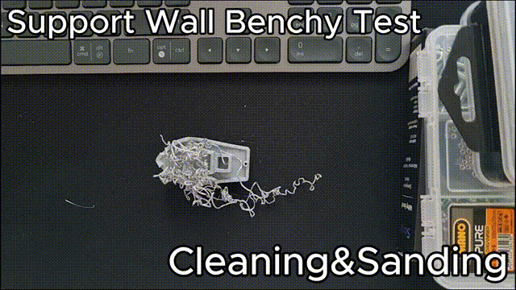

# Test 3: Plakadan kopan Benchy

[English](03-detached-benchy.md)

**Mod:** yerleştirme (beta) · **Yazıcı:** Bambu Lab P1S · **Sonuç:** başarılı, sıcak silikon ve küçük bir eğiklikle

## Ne oldu?

Bu Benchy, filament kaynaklı bir sorun yüzünden yarıda bozuldu ve plakadan koptu. Parça artık plakada değilse normal devam ettirme işe yaramaz: yazıcının üstüne devam edeceği bir şey kalmamıştır. Yerleştirme modu tam bunun için var. Yazıcı, parçanın dış hattını takip eden alçak bir duvar basar, parçayı içine koymanız için duraklar, sonra kalanını üstüne basar.

Ayrıca iyi bir zorlama testi, çünkü Benchy bu iş için zorlu bir şekil: gövdesi önde oval ve yukarı doğru genişliyor.

|                      |                 |
| -------------------- | --------------- |
| Model                | 3DBenchy        |
| Filament             | SUNLU Silk PLA+ |
| Parça yüksekliği     | 21 mm           |
| Duvar yüksekliği     | 10 mm           |
| Boşluk               | 0,13 mm         |
| Layer Rescue sürümü  | 0.2.2           |

## Adım adım

### 1. Parçayı temizleyin ve zımparalayın

https://github.com/user-attachments/assets/f8d8648f-2244-4761-8a10-8c3faa842cd4

Bozulan parçanın tepesi gevşek iplerle ("spagetti") kaplıydı. Onları çekip aldım, sonra temiz ve sağlam bir katmana inene kadar tepeyi zımparayla düzledim. Parçanın düz oturması için altını da temizledim.

Tepenin düz olması önemli: ilk yeni katman doğrudan onun üstüne basılıyor, yani her tümsek ya da gevşek parça birleşim yerine yansıyor.

Zımparadan sonra parçanın yüksekliğini kumpasla ölçtüm. Layer Rescue'ya girilen değer bu ölçülen yükseklik, baskının bozulduğu katman değil.

### 2. Tam modeli dilimleyin ve yerleştirme modunu ayarlayın

Benchy'nin tamamını dilimledim (sadece eksik üst kısmı değil, bütün modeli). Layer Rescue penceresinde yerleştirme sekmesini açtım (0.3'te: **Parça ayrıldı / bitmiş parçanın üstüne bas**), ölçtüğüm parça yüksekliğini girdim, duvarı **Preview** ile kontrol ettim, güvenlik onayını işaretledim ve G-code'u oluşturdum.

### 3. Yazıcı tutucu duvarı basıyor

https://github.com/user-attachments/assets/99555761-4c84-49d8-b92c-a49dcd886a8d

Yazıcı boş bir plakada başlıyor ve yalnızca duvarı basıyor: Benchy'nin taban şeklinde, etrafında küçük bir boşluk bırakan alçak bir halka. Sonra yükseliyor, arkaya park ediyor ve duraklıyor.

### 4. Parçayı oturtun (ve yapıştırın)

https://github.com/user-attachments/assets/f17985aa-a730-4c0d-9e2f-60b42b21a8ec

Plakayı çıkarmadan ve oynatmadan Benchy'yi duvara, Bambu Studio'daki yönüyle koydum.

Burada Benchy'nin şekli işi zorlaştırdı. Gövdenin önü oval ve dışa doğru eğimli, yani parça duvara yalnızca eğimli yüzeylerden değiyor. Doğru yerde duruyor ama onu aşağıda tutan bir şey yok; küçük bir itme bile yukarı kaldırabiliyor. Yukarı doğru genişleyen parçalarda bu beklenen bir durum: tabanın etrafındaki bir duvar onların yana kaymasını engelleyebilir ama yukarı kalkmasını engelleyemez.

#### İlk deneme: yapıştırmadan

https://github.com/user-attachments/assets/e017844e-bf03-4f2c-b133-4895173e88c9

Silikona başvurmadan önce normal yoldan denedim: parçayı duvara koydum ve Resume'a bastım. Nozzle üstüne basmaya başlar başlamaz parçayı sürükledi ve duvardan dışarı kaldırdı. Birkaç kez geri koydum, her seferinde aynısı oldu. Duvara yalnızca eğimli yüzeyler değdiği için gövdeyi aşağıda tutan hiçbir şey yoktu.

#### İkinci deneme: yapıştırarak

Bu yüzden parçayı, duvar ağzı ile gövde arasındaki birleşim çizgisi boyunca 4 noktadan sıcak silikonla sabitledim.

> **Silikonu parçaya değil, duvara sıkın.** Silikon sonradan parçadan temiz çıkıyor ama sıkıldığı yerde iz bırakıyor. Duvar nasılsa atılacak, kirliliği o üstlensin.

Yapıştırırken yanlışlıkla parçanın sağ tarafını yaklaşık 0,2 mm yukarı ittim ve parça hafifçe eğik kaldı. Bunun etkisi sonuç kısmında.

Ardından yazıcıda **Resume**'a bastım.

### 5. Yazıcı kalanını üstüne basıyor

https://github.com/user-attachments/assets/9013010e-0bf7-4e50-b81a-cc8eebb75a62

Yazıcı yeniden ısınıyor, purge yapıyor, parçanın üstüne geliyor ve kabini ve teknenin geri kalanını yerine oturtulmuş gövdenin üstüne basıyor. Parçaya değen ilk katmanlar, eski parçaya daha iyi yapışsın diye biraz daha sıcak, daha yavaş ve parça fanı kapalı basılıyor.

### 6. Sonuç

https://github.com/user-attachments/assets/1cdd1488-0212-4645-80c6-047898974835

4 nokta silikona rağmen Benchy'yi çıkarmak beklediğimden kolay oldu: maket bıçağıyla hafif bir dokunuş ve parça duvardan ayrıldı, üstünde hiç silikon kalmadı.

Yeni üst kısım sağlam bir şekilde bağlı. Yapıştırırken oluşan 0,2 mm'lik eğiklik yüzünden sol tarafta birleşim yerinde belirgin katman izleri var, ama bu sadece görüntüyle ilgili: herhangi bir boşluğa ya da zayıf noktaya yol açmadı, parça sağlam duruyor.

Birleşim yerinde görünür bir katman izi zaten normal, her şey kusursuz hizalansa bile. Henüz düzgün dayanıklılık testleri yapmadım ama yükseklik doğru olduğunda parçayı elime aldığımda birleşim yerinde yırtılma, kopma ya da ezilme olmuyor. Ne kadar sağlam olacağı yine de modelin şekline ve filamente bağlı.

## Çıkarımlar

- Yerleştirme modu hâlâ beta ve bir parçanın duvara ne kadar iyi oturduğu büyük ölçüde şekline bağlı. Bazı parçalar içine girip sıkıca oturuyor, bazıları bu parça gibi kayabiliyor, bazıları da hiç oturmayabiliyor. Bunu iyileştirmek, sonraki sürümlerde üzerinde çalışmak istediğim başlıca konulardan biri.
- Yukarı doğru genişleyen parçaları (Benchy'nin gövdesi gibi) duvar aşağıda tutamıyor. Onları birleşim çizgisinin duvar tarafına birkaç damla sıcak silikonla sabitleyin.
- Parça duvarın içinde boşta kalıyorsa duvarı daha küçük bir boşlukla basın (gelişmiş ayarlarda **Parça ile duvar arası boşluk**, CLI `--clearance`). Daha önceki bir testte yuvarlak bir parçada varsayılan 0,25 mm açıkça fazla gevşek kalmıştı, 0,12 mm ise çok daha sıkı ve iyi oturdu.
- Resume'a basmadan önce parçayı dikkatle oturtun ve her yerden düz durduğunu kontrol edin. Bir tarafta sadece 0,2 mm bile orada katman izi olarak görünüyor.
- Ölçülen parça yüksekliği, diğer testlerdeki katman numarasıyla aynı rolü oynuyor ve sadece 2–3 katmanlık (0,2 mm katmanlarda 0,4–0,6 mm) bir hata bile belli oluyor:
  - **Fazla yüksek:** ilk yeni katmanlar parçanın üstünde basılır ve ona zar zor değer. Birleşim yeri çok belirginleşir ve kırılmaya çok daha yatkın olur.
  - **Fazla düşük:** nozzle parçaya bastırır ve onu duvardan dışarı itebilir.
