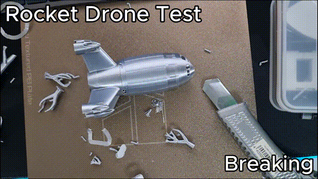

# Test 4: Broken rocket drone nose, reprinted with its supports

[Türkçe](04-broken-rocket-drone.tr.md)

**Mode:** insert (beta) with support reprinting · **Printer:** Bambu Lab P1S · **Result:** worked

## What happened

This time I wanted to test something closer to real life: a functional part that breaks after it's been printed and assembled. So I took a real rocket drone model, printed it normally and assembled it. Then I broke the top of the body on purpose, the way it would break in a nose-first crash.

The body is a hollow tube, and its nose was printed with tree supports growing up from the bed through the inside of the tube. That's what makes this test different from the [Benchy](03-detached-benchy.md): to print the nose again, those supports have to be printed again too, starting from the bed, _inside_ the part that I'm going to put back on the plate.

|                      |                                                  |
| -------------------- | ------------------------------------------------ |
| Model                | rocket drone body (hollow tube with a nose cone) |
| Filament             | SUNLU Silk PLA+                                  |
| Part height          | 52 mm (measured after sanding)                   |
| Wall height          | 15 mm (recommended)                              |
| Clearance            | 0.20 mm                                          |
| Restarts at          | layer 261 of 360                                 |
| Layer Rescue version | 0.3.0                                            |

## Step by step

### 1. Break it, then sand it flat

I took the printed body off the drone and broke the top off with a hard knock from above. The break was rough and uneven, so I sanded it flat on sandpaper until the whole edge was at one height, then measured it with calipers: 52 mm.

A flat edge is important here. The first new layer is printed straight onto it, and a step or a jagged edge would show up as a gap in the seam.

### 2. Slice the complete model and set up insert mode

In Bambu Studio I sliced the complete body plate, nose and supports included. In the Layer Rescue window I opened **Part came off / print on a finished part**:

- **Part height:** 52 mm. Layer 260 in the model sits at exactly 52 mm, so there was no offset to make up.
- **Wall height:** left blank, so it used the recommended 15 mm.
- **Gap between part and wall:** 0.20 mm (under **Show advanced settings**).

After pressing **Preview**, the result showed:

- the wall: layers 1–75, up to 15 mm,
- a pause, then printing from layer 261 of 360 onto a 0.20 mm first layer,
- **supports reprinted up to layer 260 before the pause**, the green area in the top view, right in the middle of the tube.

There were two warnings, both expected. One reminds you to remove what's left of the old supports from the part, so it slides over the new ones. The other says the part looks the same when turned (it's round), so the wall can't fix its orientation, and you have to seat it facing the same way as in Bambu Studio.

Then I ticked the safety check and created the G-code.

### 3. The printer prints the wall and the supports

This is the part I'm most happy with. Before the pause, the printer prints the round holding wall and, inside it, the lower part of the tree supports, all the way up to the part height.

Layer Rescue rebuilds **every support that reaches above the chosen height**, starting from the bed, as long as it doesn't get in the way of the part. Supports that would end up where the walls of the tube go are left out, because the part has to slide down over them. Supports that only held up something below the break aren't printed either, since that part already exists. So you get exactly the supports that the new top needs, and nothing that blocks the old part.

### 4. Seat the broken part

I cleaned the remains of the old supports out of the tube, then slid the part down over the new supports into the wall, facing the same way as in Bambu Studio. With 0.20 mm clearance it went in without forcing, and this time no glue was needed. Then I pressed **Resume**.

### 5. The printer prints the rest

The printer heats up, purges and prints the nose on top of the body, carried by the reprinted supports on the inside.

### 6. The result

After the print, I took the part out of the wall, cleaned the supports out of the inside and put the body back on the drone.

The new nose sits firmly on top of the old break. There's a visible layer line at the seam, which is normal even when the height is exactly right. I haven't done proper strength tests yet, but the seam doesn't tear, crack or crush when I handle the part. How strong it ends up still depends on the shape of the model and the filament.

I left the part as it came off the printer, without any glue. For a part like this one, which takes hits in a crash, I'd still put a few drops of superglue on the seam. It costs nothing and makes the repair a lot safer.

## Takeaways

- Insert mode can rebuild supports that start on the bed, even when they're hidden inside the part you put back. That makes it possible to repair hollow parts like this one.
- Clean the old supports out of the part before seating it, or it won't slide over the new ones.
- With a round part, the wall only stops it sliding sideways. Make sure it faces the same way as in Bambu Studio before you press Resume.
- 0.20 mm clearance gave a good, firm fit for this part.
- For functional parts that take loads or hits, it's recommended to add a few drops of superglue on the seam after printing.
- The measured part height plays the same role as the layer number in the other tests, and being off by just 2–3 layers (0.4–0.6 mm at 0.2 mm layers) already shows:
  - **Too high:** the first new layers are printed above the part and barely touch it. The seam gets very noticeable and is much more likely to break.
  - **Too low:** the nozzle presses into the part and can push it out of the wall.
