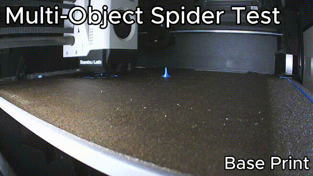

# Test 5: Five spiders, two of them lost on the way

[Türkçe](05-multi-object-spiders.tr.md)

**Mode:** resume (part still on the plate) with several objects · **Printer:** Bambu Lab P1S · **Result:** worked

## What happened

A full plate of small parts has its own typical failure: one or two of them come loose halfway, the nozzle drags them around, and the rest of the plate is at risk too. The usual fix is to cancel everything. I wanted to see if I could save the parts that were still fine.

So I printed five small spiders with supports at the same time. Halfway through, I deliberately knocked two of them off the plate with a scraper and let the print keep going for a while, as if nobody had noticed. Then I stopped it and used Layer Rescue to finish only the three spiders that were still stuck to the plate.

|                      |                                          |
| -------------------- | ---------------------------------------- |
| Model                | 5 small spiders with supports, 89 layers |
| Plate                | textured PEI                             |
| Last good layer      | 44 of 89                                 |
| Layer Rescue version | 0.2.2                                    |

## Step by step

### 1. Print the plate and lose two spiders

https://github.com/user-attachments/assets/92b0d53f-ab6a-4d06-9af6-b55bd06e5d24

The first half printed normally. Then I pushed two of the spiders off with a scraper while the printer kept going. I let it run for a while, so it kept printing those two in the air, just like it would if nobody noticed.

### 2. Stop the print and clean up

https://github.com/user-attachments/assets/e60b3fb8-a746-496c-bbaf-7d701ea37f77

I stopped the print at a lucky moment: the three remaining spiders had just finished layer 44, and the printer was printing layer 44 of the two spiders that were already gone. So the real parts ended on a complete layer.

Then I cleared away the loose spiders and the strings left where they had been. The three remaining spiders stay where they are: don't move them and don't take off the plate. The printer stays on, so it still knows where Z is.

### 3. Delete the lost spiders in Bambu Studio

https://github.com/user-attachments/assets/9a47acf3-27bc-4e04-961b-f78b08442f6a

This is the step that makes the multi-object case work. Layer Rescue continues whatever is in the G-code, so if all five spiders were still in the project, the printer would try to print the two missing ones again, from layer 45, in the air.

So in Bambu Studio I deleted the two spiders that were no longer on the plate, and left the other three exactly where they were. Don't press **Arrange** or move anything: the remaining objects have to stay in the same spots on the plate, or the nozzle won't line up with the parts that are already printed.

### 4. Slice and choose the options in Layer Rescue

https://github.com/user-attachments/assets/b78bde26-abee-437b-a84b-0cbfb7c96782

Then I sliced the edited project. In the Layer Rescue window:

- **Last layer that printed correctly:** 44.
- **Z mode:** _printer stayed powered on_ (in 0.3: "No, it stayed on the whole time").
- **Re-home X/Y:** on (Z is never homed).
- **Confirmations:** the printer never lost power, and the parts are still firmly attached to the same plate.

The preview showed only the three remaining spiders, continuing from layer 45.

### 5. Print the rest

https://github.com/user-attachments/assets/ecd8bcdf-a435-4bbf-84e4-81fa062b4a40

The printer homes X and Y, purges and carries on with all three spiders at once, supports included, from layer 45 to the end.

### 6. The result

https://github.com/user-attachments/assets/32290bc5-ad5a-4b27-9729-b00bc73d565b

All three spiders finished properly, with their supports, and came off the plate like any normal print. Two parts lost, three saved, instead of five in the bin.

The surprise was the seam: there isn't one. In every other test there was a visible layer line where the print restarted, but here the transition from layer 44 to 45 is clean, and you can't tell where it stopped. My explanation is the timing from step 2: the remaining spiders had a fully finished top layer, so the printer continued on a complete surface instead of a half-printed one. One clean result isn't enough to promise this every time, but it's a good hint.

I haven't done proper strength tests yet, but with the right layer the seam doesn't tear, crack or crush when I handle the parts. How strong they end up still depends on the shape of the model and the filament.

## Takeaways

- With several objects on the plate, delete the ones that are gone before slicing again. Leave everything else exactly where it was: no Arrange, no moving, no rotating.
- Don't change any other settings either. The layers of the remaining objects have to match what's already on the plate.
- If you get to choose when to stop, stop right after a layer has finished on the parts you want to keep. In this test that gave a seam you can't see.
- If a loose part has been dragged around by the nozzle, check the remaining parts for strings or blobs on top before resuming. The nozzle lands on them first.
- This is the same resume as in the [plane test](01-lw-pla-plane-part.md), so the same rule applies to the layer number. Being off by only 2–3 layers already shows:
  - **Too high** (you enter a layer that never actually printed): the nozzle starts above the parts and the first new layers barely touch them. The seam gets very noticeable and the parts are much more likely to break there.
  - **Too low** (you enter a layer below the real top): the nozzle runs into the parts and can easily knock them off the plate. With small parts like these, that happens quickly.
